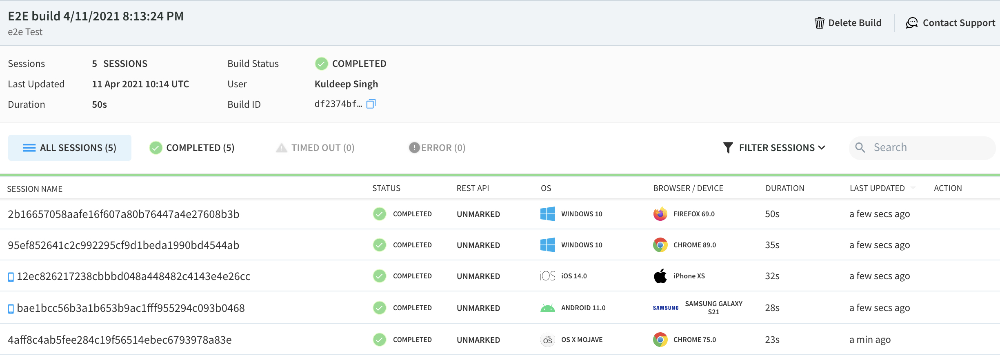

# e2e-test-automation

## Installation

* [Node](https://nodejs.org/en/) is required
* `npm install`

## Features
* Run any test to cross platform and cross browser version. 
* Scale your test execution on cloud with [Real Devices](https://www.browserstack.com/docs/onboarding/nodejs/getting-started#introduction) 

## Screens
* Run you test against cross platform and cross browser:  

* Consolidate output:  

* BrowserStack Reporting-1: List of all the test execution along with list of devices, browser and their version, execution time and status. (You may notice, I have executed the test in Chrome version 89.0 as well as 75.0)

* BrowserStack Reporting-2: includes video recording of each execution, text logs with screenshot, console logs, Network logs. 

* BrowserStack test execution video:

### Run tests from local machine on BrowserStack

* Firstly, enter your [BrowserStack](https://www.browserstack.com/) crendentials and the environment credentials in `wdio/e2e-auth.json`, then save the file locally.
* Secondly, enter a build name (`const build = XXXX;` ) in `wdio/browserstack.conf.js`, then save the file locally. Currently build name contains timestamp of the execution.
* Run `npm run start:browserstack` will run from local machine against the environment written in `package.json`
* You can also run specific feature file or a set of feature files as described below. ie. `npm run start:browserstack -- --spec TC1`

#### Run tests against localhost

* `npm start` - runs all feature files against localhost on local Chrome browser

#### Run one specific feature file

* `npm start -- --spec ./features/TC1.sayHello.feature.ts`

Note: You can also drag a file from the vscode sidebar into the terminal.

#### Run a set of feature files based on partial filename

* `npm start -- --spec TC` - runs all .feature.ts files with the text `TC` in the filename.

## Unit Testing

* `npm test` - runs all the test (.spec) files for unit testing

## Targetting an alternative URL

By default the feature tests execute against the localhost port 9500 (must be running as a seprate process).

* This can be configured in the 'baseUrl' property in ./wdio/base.conf.js.

The URl can be overridden for a specific test run via:

* `npm run start:dev` - runs the full feature suite agains the dev draft
* `start:browserstack:direct` - runs the full feature suite against the passed base URL from the `package.json`
* `npm run start -- --baseUrl https://any-url-can-be-here/` (note the `--` to pass args to the underlying command)

## Stack

Built on the JavaScript stack using:

* [Typescript](https://www.typescriptlang.org/) - Typescript is a typed superset of JavasScript
* [WebdriverIO](http://webdriver.io/) - runs Chrome in automation mode
* [Jasmine](https://jasmine.github.io/) - test runner and assertion library
* [Mochaawesome Report Generator](http://webdriver.io/guide/reporters/mochawesome.html) - generates reports from Webdriver JSON output using a utility called marge
* [BrowserStack](https://www.browserstack.com/) - to execute the test in any specific platform and browser versions

## Reporting

After running the tests Webdriver will generate a JSON file in the folder `report`.

Generating the HTML report requires an additional step:

* `npm run report` - this will convert the JSON file to a HTML report with mochawesome and marge.

## BrowserStack Reporting

After running the tests Webdriver will generate a JSON file in the folder `report`.

## Development

| Configuration | Description    |
| -------- | ----------------------------------------- |
| Typescript    | see `tsconfig.json`   |
| TSLint      | see `tslint.json`       |
| Prettier | See the `prettier` key in package.json  |
| wdio (Webdriver.io) | Folder: ./wdio/*.config.js  |
||

### Naming Conventions

#### Files

* All files should be named with kebab-case - eg. `my-sweet-file.ts`

#### Variables

* `SOME_CONSTANT = "foo";`
  * Constants should be all caps with underscores
* `_I_want_this_to_be_rendered_as_a_sentence_today_with_Proper_Nouns = () => 'do stuff';`
  * Special case where we want to render the output in the test reporter and use a function name that reads better.
  * Really should be only used within the given, when, and, then calls within a feature file
  * Should be very descriptive and start with leading underscore.
* `someNormalFunction`
  * All functions should be camelCase (except for the above)
* `SomeEpicClass`
  * All classes should be UpperCamelCase
* `ESomeEnum`
  * When defining an Enum - start with captial E
* `ISomeInterface`
  * When defining an Interface - start with capital I

### VSCode

* Recommended editor is VSCode
* See ./vscode for browser configuration and recommended extensions

## Debugging

* Using [`browser.debug()`](https://webdriver.io/docs/api/browser/debug.html) webdriverio let's you put a special debug call anywhere in the test code. This will 'pause' the runner and turn the CLI into a REPL to explore what is happening.
* When the above debug is called, if you want the runner to continue simply type `.exit` into the terminal and it will go on.
* `console.log` is also useful and will log out to the terminal where your script is run.
* Watch the runner carefully, look at what happens in the logs and on the screen in what order.
* Sometimes it can help to 'slow' the network down, when the runner starts open the chrome dev tools and then on the network tab select a slower network speed.
